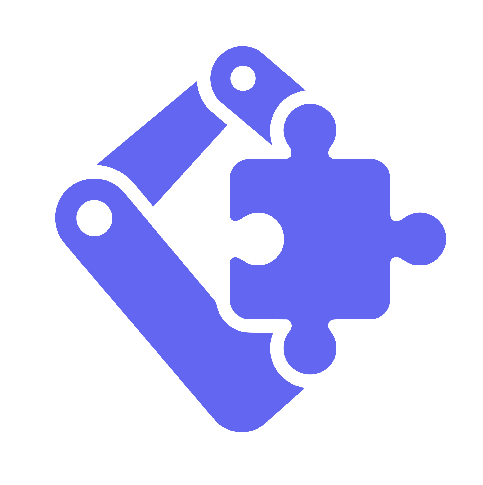

<div align="center">



# DTblocklyGPT

**Build a robot task out of blocks, watch it run in a digital twin, then run it on a real arm.**

An End-User Development environment where a person with no programming background can compose a
task for a Denso COBOTTA, including the steps the robot cannot do alone and has to wait for a
human to do.


</div>


## What it does

You describe a task in chat or drag it together out of blocks. The system turns it into a program
the robot can run, shows you the arm executing it in a live 3D twin, and stops when the task
reaches a step only a person can do.

A block that says *"pause and show a message"* suspends the interpreter. The arm holds the position
it reached without dropping what it is carrying, and the program resumes when one of four channels
says so.

| Channel | How you answer | Kind |
|---|---|---|
| Button | Click Confirm in the robot panel | direct |
| Voice | Say one of four commands (`sì` / `no` / `fatto` / `procedi`, Italian or English) | direct |
| Gesture | Show one of six hand signs to your webcam | direct |
| Object | Put the expected object in front of the cell camera | indirect: nobody signals, the world changes |

> [!NOTE]
> The same program runs in simulation and on the physical arm. Which one moves is decided by two
> independent keys, a server flag and a per-request flag. Neither alone moves anything.

<!--
  SCREENSHOTS. Drop images into docs/images/ and uncomment.
  Suggested set, in this order:
    1. workspace.png  the three-pane editor: chat, blocks, robot panel
    2. waiting.png    a run paused on "Pause and show", countdown visible
    3. twin.png       the Gazebo twin mid-pick with the running block highlighted

## Screenshots

| Composing a task | Waiting for the operator |
|---|---|
|  |  |
-->


## Architecture

Five processes on the local network. All of them have to be up for the full system.

```
  ┌──────────────────────────────┐
  │  FRONTEND        :3000       │  chat · Blockly editor · robot panel
  └──────┬────────────────▲──────┘
    task │                │ video + "I am on this block"
         ▼                │
  ┌──────────────────────────────┐
  │  BACKEND         :8000       │  REST · SQLite · LLM · inverse kinematics
  └──────┬────────────────▲──────┘
  joints │                │ "object seen" / "gesture seen"
         ▼                │
  ┌──────────────────────────────┐        ┌──────────────────┐
  │  BRIDGE          :5000       │───────▶│  VISION NODE     │
  │  HTTP → ROS 2    :5001 (ws)  │◀───────│  YOLOE·MediaPipe │
  └──────┬───────────────────────┘        └──────────────────┘
         ▼
  ┌──────────────────────────────┐  ····▶ ┌──────────────────┐
  │  ROS 2 JAZZY + GAZEBO        │ two    │  DENSO COBOTTA   │
  │  gz_ros2_control · MJPEG:8080│ keys   │  RC8 · b-CAP     │
  └──────────────────────────────┘        └──────────────────┘
```

> [!IMPORTANT]
> Two Python environments coexist, and mixing them breaks things.
>
> | Environment | Holds | Used by |
> |---|---|---|
> | Poetry (`pyproject.toml`) | Django, `ikpy`, `ultralytics`, `mediapipe` | backend, and `vision_node` |
> | `ros2_ws/.venv` (`--system-site-packages`) | Flask, ROS 2 bindings | Flask bridge, all other ROS nodes |
>
> This is also why `bcapclient.py` exists twice. Neither environment can see the other's packages,
> so do not "deduplicate" it.

The Flask bridge exists for the same reason: without that boundary the Django backend would have
to live inside the ROS environment and inherit its dependencies.

> [!TIP]
> Code names and UI labels differ on purpose (`action_block` in code is "Skills" on screen).
> Conversion table: [docs/ui-naming-map.md](docs/ui-naming-map.md).


## Quick start

Already set up? Three terminals, in this order.

```bash
# 1 — simulation stack (Gazebo, bridge, controllers, video)
cd ros2_ws/Cobotta && bash launch_sim.sh      # add SKIP_BUILD=1 after the first run

# 2 — backend
poetry run python manage.py runserver

# 3 — frontend
npm start
```

Open http://localhost:3000 and log in as `operator1` / `Operator_1!`.

```bash
# Did the stack actually come up? launch_sim.sh does not verify anything.
poetry run python testing/preflight.py
```


## Setup

<details>
<summary><strong>1 · Prerequisites</strong></summary>

- Ubuntu 24.04 (Noble), native or in WSL2 or a VM
- ROS 2 Jazzy ([install guide](https://docs.ros.org/en/jazzy/Installation/Ubuntu-Install-Debs.html))
- Gazebo Harmonic ([install guide](https://gazebosim.org/docs/harmonic/install_ubuntu/))
- Python 3.12 or 3.13, pinned `>=3.12,<3.14`. Ubuntu 24.04 ships 3.12
- Poetry ([install guide](https://python-poetry.org/docs/#installation))
- Node.js 20.19+ or 22 LTS. Vite 8 requires `≥20.19`/`≥22.12`; older 20.x fails

```bash
sudo apt update && sudo apt install -y \
    ros-jazzy-ros-gz python3-colcon-common-extensions python3-rosdep \
    python3-virtualenv curl psmisc build-essential cmake \
    libboost-dev libboost-filesystem-dev libboost-thread-dev \
    libopencv-dev libasio-dev

sudo rosdep init   # "already initialized" is safe to ignore
rosdep update
```

`ros-jazzy-ros-gz` provides the `ros_gz_bridge` that `launch_sim.sh` needs. The
`build-essential`/`cmake`/boost/asio packages compile the C++ streaming packages in `ros2_ws/src/`.

</details>

<details>
<summary><strong>2 · Clone this repository and the streaming packages</strong></summary>

```bash
git clone https://github.com/SickCiQuattro/DTblocklyGPT.git
cd DTblocklyGPT
```

> [!NOTE]
> This fork is where the collaborative-step, digital-twin and vision work lives. It is intended to
> be merged back into
> [luigigargioni/DTblocklyGPT](https://github.com/luigigargioni/DTblocklyGPT); until that happens,
> clone from here. Upstream does not contain any of it yet.

Two ROS packages are not bundled here and must be cloned into the workspace:

```bash
cd ros2_ws/src
git clone https://github.com/fkie/async_web_server_cpp.git
git clone https://github.com/RobotWebTools/web_video_server.git
cd ../..
```

> [!WARNING]
> Both are moving development branches, so a fresh clone may not match what this project was built
> against. The versions used were `async_web_server_cpp` at `be0ca7b` (2026-05-06) and
> `web_video_server` at `20c30ab` (2026-07-02). If `colcon build` fails on a fresh clone, check
> those out before assuming the fault is here.

</details>

<details>
<summary><strong>3 · Environment files</strong></summary>

```bash
cp backend/.env.example backend/.env
cp frontend/.env.example frontend/.env
```

`backend/.env`. The chat assistant does not work without a key:

```env
FLASK_BRIDGE_URL = "http://localhost:5000"
LLM_PROVIDER     = "gemini"                  # gemini · openai · ollama
LLM_MODEL        = "gemini-3.5-flash-lite"
GEMINI_API_KEY   = "your_key_here"
OPENAI_API_KEY   = ""
```

> [!CAUTION]
> Set `LLM_MODEL` explicitly. Left unset, the code falls back to `gemini-2.5-flash`, which is a
> different model from the one this project is configured and evaluated on, and nothing says so.

`frontend/.env`. All six values are required:

```env
VITE_BACKEND_PROTOCOL  = http://
VITE_BACKEND_HOST      = localhost
VITE_BACKEND_PORT      = :8000
VITE_FRONTEND_PROTOCOL = http://
VITE_FRONTEND_HOST     = localhost
VITE_FRONTEND_PORT     = :3000
```

> [!NOTE]
> The three `VITE_FRONTEND_*` values are read by Django (`CSRF_TRUSTED_ORIGINS`), not by any
> frontend code, despite the prefix. Leave them empty and `manage.py runserver` fails its system
> check.

</details>

<details>
<summary><strong>4 · Dependencies</strong></summary>

```bash
poetry install                    # backend: Django, ikpy, ultralytics, mediapipe
npm ci --legacy-peer-deps         # frontend
```

> [!TIP]
> Use `npm ci`, not `npm install`. `package-lock.json` is committed and `ci` installs exactly what
> it pins. `blockly` is declared `^13.0.0`, and the editor's keyboard layer depends on shortcut
> names a Blockly release can rename, which is why `features/blockly/editor/appShortcuts.ts`
> carries a drift check. Run `npm install` only when you mean to take updates, then re-run
> `npm run lint` and try the shortcuts.

The gesture model is not bundled with its wheel. Download it once:

```bash
mkdir -p backend/assets
curl -L "https://storage.googleapis.com/mediapipe-models/hand_landmarker/hand_landmarker/float16/latest/hand_landmarker.task" \
     -o backend/assets/hand_landmarker.task
```

`yolov8n.pt` downloads itself on first inference; the first run needs network access.

</details>

<details>
<summary><strong>5 · Build the ROS 2 workspace</strong></summary>

```bash
cd ros2_ws
source /opt/ros/jazzy/setup.bash
rosdep install --from-paths src --ignore-src -r -y

virtualenv .venv --system-site-packages
source .venv/bin/activate
pip install Flask flask-socketio flask-cors

colcon build                      # the WHOLE workspace — no --packages-select
source install/setup.bash
cd ..
```

> [!WARNING]
> Do not skip the full build. `launch_sim.sh` rebuilds only `cobotta_rest_api`, so if this never
> ran, `web_video_server` is missing and the camera panel stays empty at runtime.

</details>

<details>
<summary><strong>6 · Database</strong></summary>

`db.sqlite3` is committed and already contains users, robots, locations and example tasks, so a
fresh clone needs nothing.

To rebuild the catalogue from scratch, the order is mandatory:

```bash
poetry run python manage.py seed_library          # objects, locations, skills
poetry run python manage.py seed_partb_tasks      # the four study tasks
poetry run python manage.py seed_study_users --count 12
```

> [!CAUTION]
> `seed_library --reset` deletes every task and object owned by the target user before
> reseeding, and it has no `--dry-run`. It is not a safe way to apply a rename to a database that
> holds work you want to keep.

</details>


## Platform paths

Everything above and below is identical on all three. These are the differences.

<details>
<summary><strong>Windows + WSL2</strong></summary>

```powershell
# PowerShell as Administrator
wsl --update
wsl --install -d Ubuntu-24.04
wsl --set-default Ubuntu-24.04
```

Restart when prompted, then open Ubuntu from the Start menu and finish the user setup.

All processes run inside WSL, and your Windows browser reaches them on `localhost`, because WSL2
forwards ports to the host automatically. Open `http://localhost:3000`.

For VS Code, install the WSL extension and run `code .` from inside the WSL terminal. Every
integrated terminal then runs in Linux.

Gazebo is heavy and WSL2's default memory allocation is a fraction of your RAM. Create
`C:\Users\<you>\.wslconfig`:

```ini
[wsl2]
memory=8GB
processors=4
```

Then `wsl --shutdown` and reopen.

> [!IMPORTANT]
> Gesture recognition works. Object detection needs one extra step.
>
> Gestures are read by the browser (`getUserMedia`), which runs on Windows, so your laptop webcam
> works with no configuration.
>
> `vision_node` is different: it opens `camera_source` *inside Linux*, and WSL2 exposes no USB
> video device, so the default `0` finds nothing. Either attach the device with
> [usbipd-win](https://learn.microsoft.com/windows/wsl/connect-usb), or point the node at a network
> camera instead:
>
> ```bash
> ros2 run cobotta_rest_api vision_node --ros-args -p camera_source:="http://192.168.0.90/stream"
> ```

> [!WARNING]
> Driving the physical arm from WSL2 needs mirrored networking. WSL2 is NAT'd by default and
> cannot reach a robot on a physical LAN such as `192.168.0.1`. On Windows 11 22H2+, add
> `networkingMode=mirrored` under `[wsl2]` in `.wslconfig`. Otherwise use a native Linux machine
> for hardware runs.

Gazebo's 3D window needs WSLg (Windows 11). On Windows 10 keep it headless, which is the default
anyway.

</details>

<details>
<summary><strong>Virtual machine (including macOS hosts)</strong></summary>

There is no ROS 2 Jazzy / Gazebo Harmonic build for macOS. Run Ubuntu 24.04 in a VM
(UTM / Parallels / VMware). On Apple Silicon use an ARM64 image, and keep Gazebo headless because
the 3D GUI is CPU-rendered and slow.

Working over SSH, forward every port:

```bash
ssh -L 3000:localhost:3000 -L 8000:localhost:8000 \
    -L 5000:localhost:5000 -L 5001:localhost:5001 \
    -L 8080:localhost:8080 you@your-vm
```

VS Code's Remote-SSH extension forwards these for you. Check its Ports tab.

> [!NOTE]
> A stock QEMU/UTM VM has no `/dev/video*` at all, so `vision_node` cannot open a local camera.
> Pass a USB device through from the hypervisor, or give `camera_source` a network camera URL.
> Browser-side gesture recognition is unaffected, since it uses the host's webcam.

</details>

<details>
<summary><strong>Native Linux</strong></summary>

Nothing extra. This is the path the project is developed and evaluated on, and the only one where
the physical arm, the cell camera and the 3D GUI all work without configuration.

</details>


## Running

### Simulation

```bash
# Terminal 1
cd ros2_ws/Cobotta && bash launch_sim.sh          # SKIP_BUILD=1 to skip the rebuild

# Terminal 2
poetry run python manage.py runserver

# Terminal 3
npm start
```

`launch_sim.sh` starts Gazebo (headless), `ros_gz_bridge`, the `ros2_control` spawners and the
`flask_node` / `polling_socket_node` / `web_video_server` nodes. It launches them and returns
without verifying anything, so check the result with `testing/preflight.py`.

To see the 3D window, remove `-s` from the `gz sim` line inside the script.

<details>
<summary><strong>Launching nodes individually</strong></summary>

Each node needs its own terminal with the environment sourced:

```bash
source /opt/ros/jazzy/setup.bash
cd ros2_ws && source .venv/bin/activate && source install/setup.bash
```

```bash
ros2 run cobotta_rest_api flask_node
ros2 run cobotta_rest_api polling_socket_node
ros2 run cobotta_rest_api cobotta_node --ros-args -p enable_hardware:=true   # real arm only
```

`vision_node` is the exception. It needs the Poetry environment, so launch the file rather than
the entry point:

```bash
poetry run python ros2_ws/src/cobotta_rest_api/cobotta_rest_api/vision_node.py \
    --ros-args -p camera_source:=0
```

`poetry run ros2 run …` fails with `ModuleNotFoundError: ultralytics`, because the entry-point
shebang points at the system python.

The only real console scripts are `flask_node`, `cobotta_node`, `polling_socket_node`,
`vision_node`. There is no `gazebo_command_node` or `gazebo_state_node`. The wiring between Gazebo
and ROS is the standard `gz_ros2_control` plugin.

</details>

### Physical COBOTTA

<details>
<summary><strong>Prerequisites and startup</strong></summary>

One-time setup:
- Client PC on the robot LAN `192.168.0.0/24` (robot `.1`, camera `.90`, PC `.100`) through a PoE
  switch. See [docs/cobotta-connection.md](docs/cobotta-connection.md)
- Executable Token set on the controller (`Any`, or `Ethernet` + PC IP) from a Teach Pendant, or
  the motors will not turn on. See [docs/cobotta-physical-testing.md](docs/cobotta-physical-testing.md) §6b

```bash
# T1 — twin + real arm + cell camera
cd ros2_ws/Cobotta
ENABLE_VISION=1 BCAP_HOST=192.168.0.1 EXT_SPEED=20 \
YOLO_MODEL=yoloe-11s-seg.pt YOLO_CLASSES="test tube,medicine bottle,beaker,bowl" \
bash launch_physical.sh
#   wait for "B-CAP connected (ExtSpeed=20)"

# T2 — backend, hardware armed
VISION_MODEL=yoloe DRIVE_HARDWARE=1 poetry run python manage.py runserver

# T3 — frontend
npm start
```

> [!NOTE]
> `VISION_MODEL` (backend) must match `YOLO_MODEL`/`YOLO_CLASSES` (ROS). The two configs cannot
> discover each other, and a mismatch means the node publishes class names the backend never
> looks for.

```bash
curl -s http://localhost:5000/api/actual-joints-real | python3 -m json.tool   # {"available":true,…}
curl -s http://localhost:5000/api/vision/state       | python3 -m json.tool   # detections
```

> [!CAUTION]
> **Keep the teach-pendant e-stop in hand.** `/api/stop` halts the simulation and sends a soft halt
> to the arm over a dedicated b-CAP channel, but it is best-effort and **not safety-rated**. The
> e-stop is the only certified stop. Start at `EXT_SPEED=20`.

Field guide: [docs/cobotta-quickstart.md](docs/cobotta-quickstart.md).
Camera and detection: [docs/cobotta-camera-object-detection.md](docs/cobotta-camera-object-detection.md).

</details>

### User-study mode

<details>
<summary><strong>Running a measured session</strong></summary>

Study mode removes every shortcut that could resolve a step without the participant, and records
one JSON line per event.

```bash
# frontend/.env
VITE_STUDY_MODE=1
```

```bash
# backend — one participant per run, both IDs updated together
VISION_MODEL=yoloe \
DRIVE_HARDWARE=1 \
HUMAN_STEP_TIMEOUT_S=60 \
STRICT_CONDITIONS=1 \
STUDY_LOG_PATH=studio-utenti/dati/P03.jsonl \
STUDY_PARTICIPANT_ID=P03 \
poetry run python manage.py runserver
```

| Variable | Effect |
|---|---|
| `VITE_STUDY_MODE=1` | Forces live execution, hides the "simulate event" escape hatch, locks the wait-time field, and disables HMR module updates |
| `STRICT_CONDITIONS=1` | A condition can only be satisfied by a real signal, so no confirmation can be fabricated |
| `HUMAN_STEP_TIMEOUT_S` | Seconds a human step waits. In study mode this is the only way to set it |
| `STUDY_LOG_PATH` | Enables logging. Unset, nothing is written at all |

> [!WARNING]
> Verify the log file is growing before the first real participant. `log_event` never raises,
> because a logging failure must not abort a run, so a misconfigured path fails silently.

> [!CAUTION]
> For a measured session, serve a **build** rather than the dev server. Vite's client reloads the
> page whenever its WebSocket drops, and a machine running Gazebo under thermal throttling drops
> one routinely. `VITE_STUDY_MODE=1` sets `server.hmr: false`, which stops module updates but
> **does not** stop that reload: measured on 2026-09-10, the `vite-hmr` socket still connects with
> the flag on. A build has no Vite client in it at all, so it cannot reload itself.
>
> ```bash
> VITE_STUDY_MODE=1 npx vite build     # once, before the session
> npx vite preview --port 3000         # serves at http://localhost:3000/static/
> ```
>
> The `/camera` proxy works in preview exactly as in dev. Rebuild after any code change; preview
> serves what was built, not what is on disk.

Outside study mode the wait time is set from the robot panel (5 to 300 seconds) and remembered per
browser.

</details>


## Tests

```bash
# Full offline suite — no Gazebo, no ROS, no robot, no network
PYTEST_DISABLE_PLUGIN_AUTOLOAD=1 poetry run python -m pytest testing/ -q

# Live end-to-end (needs the simulation running)
poetry run python testing/test_ik_regression.py

# Stack health
poetry run python testing/preflight.py
```

675 tests guard the properties where a defect moves a mechanical arm in space shared with a
person: the two-key hardware consent, inverse-kinematics discipline, twin-versus-encoder
agreement, grasp verification, and the human-step wait semantics.

> [!NOTE]
> `PYTEST_DISABLE_PLUGIN_AUTOLOAD=1` is required. Without it, pytest picks up ROS Jazzy's
> `launch_testing_ros` plugin from the system site-packages, which mis-resolves the package and
> then fails importing a dependency this environment does not have.

ROS-side tests need the sourced ROS environment:

```bash
cd ros2_ws && colcon build --packages-select cobotta_rest_api
PYTEST_DISABLE_PLUGIN_AUTOLOAD=1 python3 -m pytest src/cobotta_rest_api/test/ -v
```


## Credentials and ports

| Role | Username | Password |
|---|---|---|
| Operator | `operator1` | `Operator_1!` |
| Manager | `manager1` | `passwordmanager1` |
| Django admin | `admin` | `adminpassword` |

> [!NOTE]
> In the shipped database `operator1` is actually in the `Manager` group despite its name, so it
> can reach the admin pages too. Use `manager1` to test the Operator-only restriction.

| Service | Port |
|---|---|
| Frontend | `3000` |
| Backend | `8000` |
| Flask bridge | `5000` |
| Event stream (SocketIO) | `5001` |
| Camera stream | `8080` |


## Troubleshooting

| Symptom | Cause | Fix |
|---|---|---|
| `package 'web_video_server' not found` | Streaming repos not cloned | Setup step 2, then a full `colcon build` |
| `package 'ros_gz_bridge' not found` | Missing apt package | `sudo apt install ros-jazzy-ros-gz` |
| `colcon build` fails with C++ errors | Missing system libs | Install the `build-essential`/cmake/boost/asio set from step 1 |
| `ModuleNotFoundError: ikpy` | Wrong environment | `ikpy` is a Poetry dependency. Run `poetry install`, and never `pip install` into `.venv` |
| `ModuleNotFoundError: rclpy` in the Poetry shell | ROS bindings are not in Poetry | Use `ros2_ws/.venv` for ROS nodes |
| `ModuleNotFoundError: ultralytics` from `vision_node` | Launched via `ros2 run` | Launch the file with `poetry run python …` |
| Gesture always `NONE`, no error | `hand_landmarker.task` missing | Setup step 4, download the model |
| `POST /api/vision/frame/` returns 500 | Same as above | Same as above |
| Object detection finds nothing on WSL/VM | No `/dev/video*` in the guest | usbipd-win, or a network `camera_source` |
| The app loads but Run does nothing | Flask bridge down | Check terminal 1; `:5000` must answer |
| `runserver` fails on `CSRF_TRUSTED_ORIGINS` (4_0.E001) | `VITE_FRONTEND_*` empty | Fill all three in `frontend/.env`; Django reads them |
| CORS/CSRF errors in the browser | Ports not forwarded | Forward 3000, 8000, 5000, 5001, 8080 |
| The page reloads by itself mid-task | Vite's client reacting to a dropped WebSocket | Serve a build (`vite build` then `vite preview`), not the dev server. `hmr: false` alone does not stop it |
| `'X' didn't come up with the gripper` | Weld lost a `gz` message | Fixed by the retry budget; if it persists, restart the Gazebo stack |


## Documentation

| Document | Covers |
|---|---|
| [docs/cobotta-quickstart.md](docs/cobotta-quickstart.md) | Field guide for a physical session |
| [docs/cobotta-connection.md](docs/cobotta-connection.md) | Network, PoE switch, controller setup |
| [docs/cobotta-physical-testing.md](docs/cobotta-physical-testing.md) | Hardware test procedure and safety |
| [docs/cobotta-camera-object-detection.md](docs/cobotta-camera-object-detection.md) | Cell camera and detection tuning |
| [docs/ui-naming-map.md](docs/ui-naming-map.md) | Code identifiers and their on-screen labels |


## Citation

This repository extends the prototype described in:

> Gargioni, Luigi and Fogli, Daniela.
> *"Integrating ChatGPT with Blockly for End-User Development of Robot Tasks"*.
> Companion of the 2024 ACM/IEEE International Conference on Human-Robot Interaction, pages
> 478-482, 2024. ACM, New York.
> [doi.org/10.1145/3610978.3640653](https://dl.acm.org/doi/abs/10.1145/3610978.3640653)

```bibtex
@inproceedings{gargioni2024integrating,
  title={Integrating ChatGPT with Blockly for End-User Development of Robot Tasks},
  author={Gargioni, Luigi and Fogli, Daniela},
  booktitle={Companion of the 2024 ACM/IEEE International Conference on Human-Robot Interaction},
  pages={478--482},
  year={2024}
}
```
